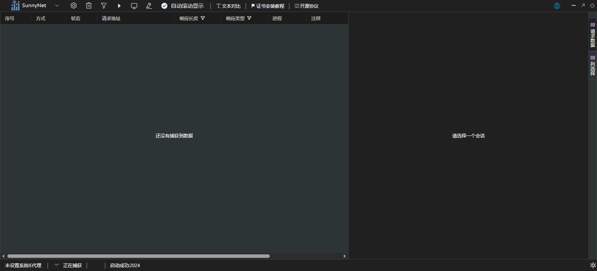

# README

## Sunny网络中间件-抓包工具
 
核心功能基于: https://github.com/qtgolang/SunnyNet 开发
 
## 此软件基于wails + vue 编写 
`
由于本人第一次接触wails vue,从接触wails vue第3天开始编写本项目,vue代码写的很烂,大佬勿喷,
`
## Building
 * MacOs 成品下载地址:
 * * https://wwxa.lanzouj.com/b0ciopv1c 
 * * * 密码:2oxf
 * 
 * Windows 成品下载地址:
 * * https://wwxa.lanzouj.com/b0cior9kb
 * * * 密码:2brf

